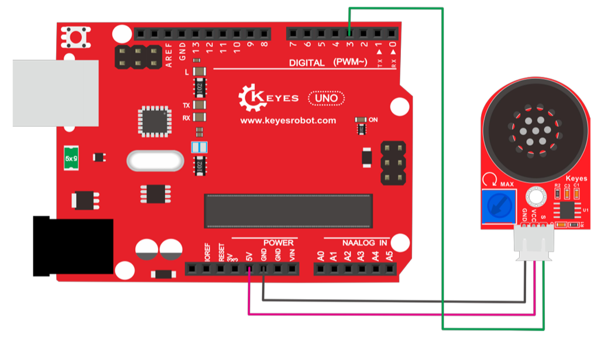

# Intellicoaster

Awarded 2nd place of the MediaTek Company Award in MakeNTU 2023!

## Software

See more in `API/README.md`.

## HardWare

### ESP8266 NodeMCU

##### Instructions

Need install ESP8266 NodeMCU Board manager:
Go To File -> Preferences, find "Additional boards manager URLs", enter **http://arduino.esp8266.com/stable/package_esp8266com_index.json**
Go To Tools -> Board: "" -> Boards Manager, enter "esp8266", and install

##### Designs

-   Test API:
    Code: http_request_test.ino

### DFPlayer(mp3 decoder)

##### Instructions

Need install DFplayer library in Arduino IDE: [DFRobotDFPlayerMini](https://github.com/DFRobot/DFRobotDFPlayerMini)
Paired with Amplifier to play files

##### Designs

-   Test:
    
    Code: `DFPlayer_test.ino`

### HX711 Sensor

##### Instructions

Need install HX711 library in Arduino IDE: [HX711_ADC](https://github.com/olkal/HX711_ADC)

##### Designs

-   Test:
    Code: `HX711_test/Calibration.ino`

### Amplifier: SC8002B

##### Instructions

Paired with **DFPlayer module**
S: Source(only need single input)
V: Voltage Input(5V)
G: Ground

##### Designs

-   Test:
    
    Code: `amplifier_test.ino`
    Ref: [8002B Manual](https://usermanual.wiki/m/522e711f739865b07e7657ed286be8a3922e3662aadf33fa6edea18b42717bd4.pdf)

### Todos

-   [ ] HX711 pair with ESP8266
-   [ ] DFPlayer can be controlled by Frontend
-   [ ] Add more songs
